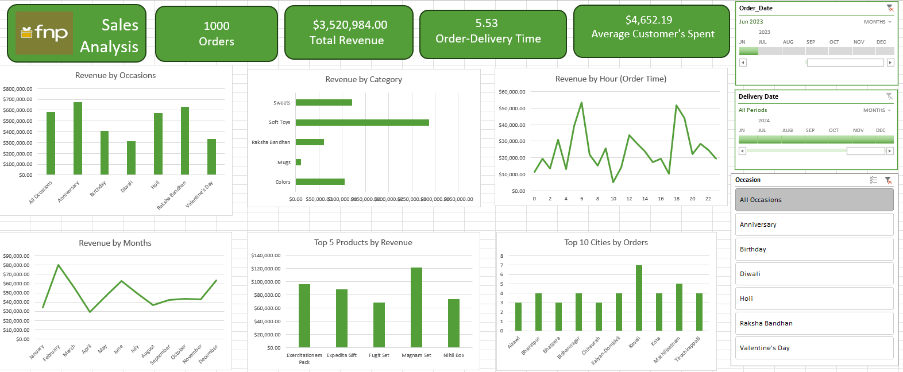

# FNP Sales Analysis Dashboard (Excel Project)

## Project Overview

This project is an **Excel-based Sales Analysis Dashboard** created to analyze sales performance for Ferns N Petals (FNP). The dashboard provides insights into revenue trends, customer spending behavior, product performance, and order patterns.

The goal of this project is to transform raw sales data into **meaningful visual insights** using Excel tools such as Pivot Tables, Pivot Charts, and interactive slicers.

---

## Dashboard Preview

---

## Key Metrics

The dashboard displays key performance indicators that provide a quick overview of business performance:

* **Total Orders:** 1000
* **Total Revenue:** $3,520,984
* **Average Order-Delivery Time:** 5.53 days
* **Average Customer Spend:** $4,652.19

---

## Dashboard Insights

### Revenue by Occasion

This chart shows revenue generated from different occasions such as:

* Anniversary
* Birthday
* Diwali
* Holi
* Raksha Bandhan
* Valentine's Day

It helps identify which events contribute most to overall sales.

---

### Revenue by Category

Analyzes revenue distribution across product categories like:

* Sweets
* Soft Toys
* Raksha Bandhan Gifts
* Mugs
* Colors

This helps identify the **best-performing product categories**.

---

### Revenue by Hour (Order Time)

This visualization highlights **hourly order trends**, helping identify peak ordering times during the day.

---

### Revenue by Month

Shows monthly revenue trends to understand **seasonal demand patterns**.

---

### Top 5 Products by Revenue

Displays the products generating the highest revenue, helping businesses focus on **high-performing products**.

---

### Top 10 Cities by Orders

Highlights cities with the highest number of orders, providing insights into **geographical demand patterns**.

---

## Interactive Filters

The dashboard includes interactive slicers that allow users to filter the data by:

* **Order Date**
* **Delivery Date**
* **Occasion**

These filters enable dynamic exploration of the data.

---

## Tools & Skills Used

* **Microsoft Excel**
* Pivot Tables
* Pivot Charts
* Data Cleaning
* Data Analysis
* Dashboard Design
* Slicers for Interactive Filtering

---

## How to Use

1. Download the Excel file from this repository.
2. Open it using **Microsoft Excel**.
3. Use the slicers to interact with the dashboard and explore insights.

---

## Project Purpose

This project demonstrates the ability to:

* Clean and analyze sales data
* Create interactive dashboards using Excel
* Generate business insights from data
* Present data visually for better decision-making

---

## Author

**Saumya Jain**

